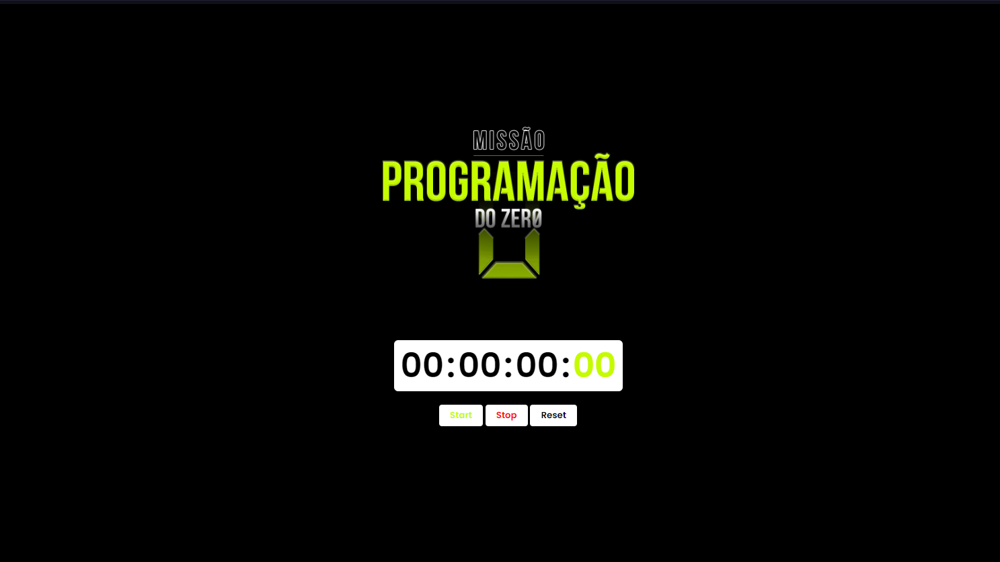

# Cronometro
Semana do missão programação do zero onde desenvolvemos um cronometro com: HTML, CSS e JavaScript

 <h2>💻Tecnologias utilizadas: </h2> 

 - 
 - 
 - 
 <a href=""> <b>Projeto hospedado</b>
 
 
